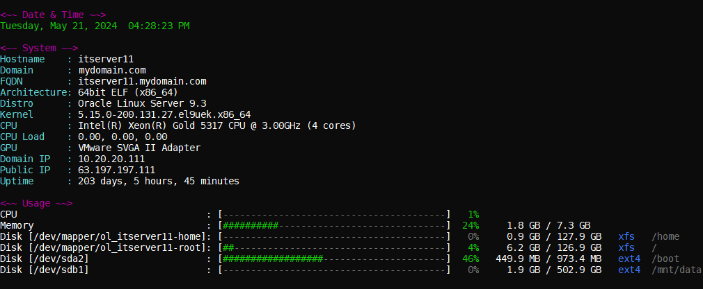
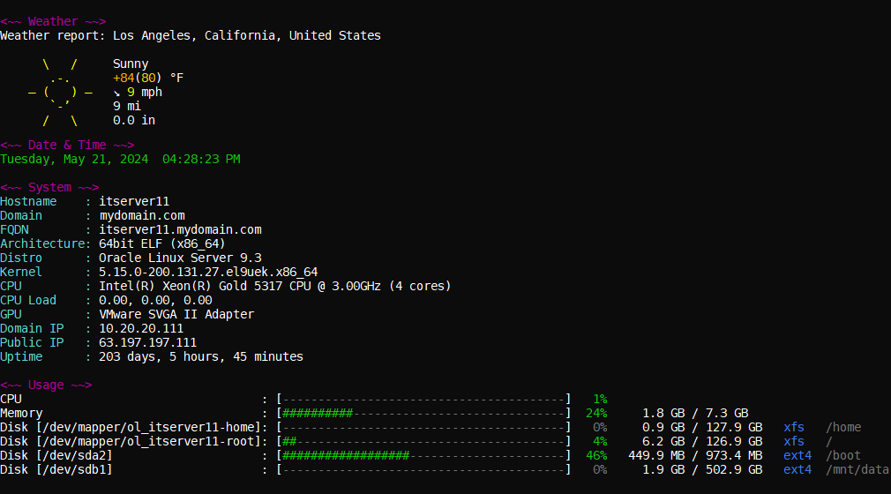
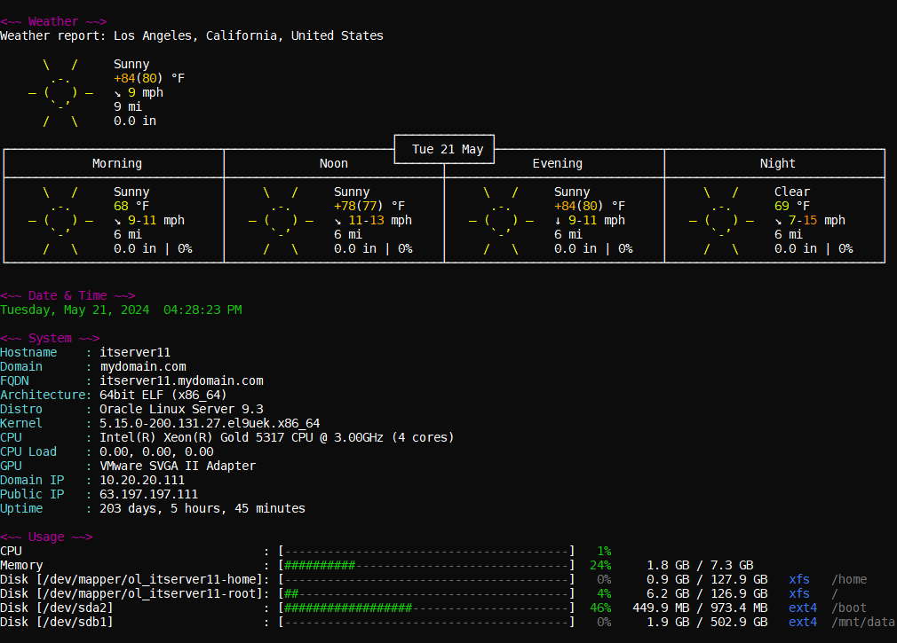
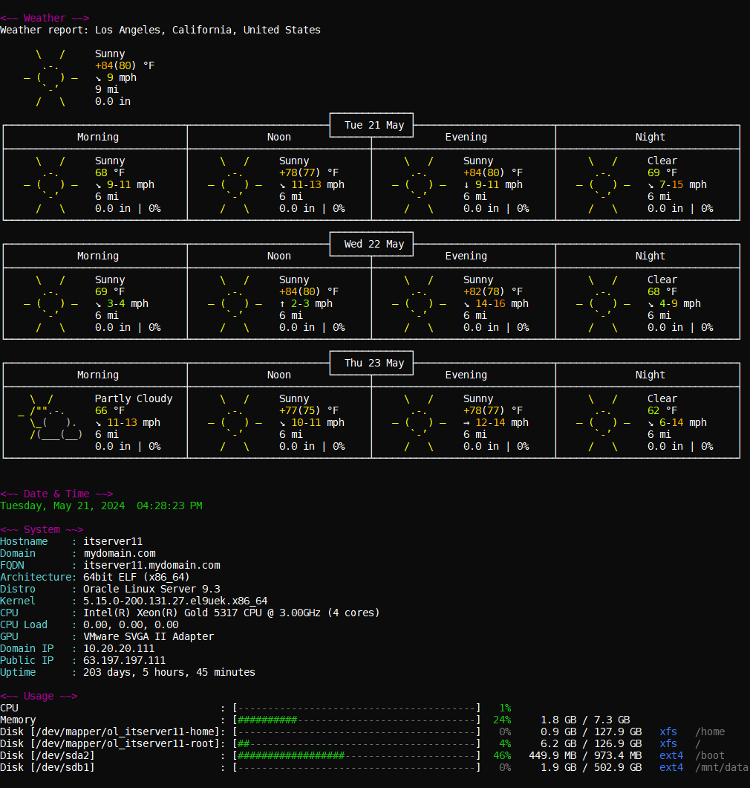

# pySysInfo
This tool utility is a purely Python-based system information tool for GNU/Linux and is similar to neofetch, fastfetch, et al.

## Features
Displays: 

1. Current weather information and forecast for current day from wttr.in
2. Current date and time
3. System information (hostname, domain, arthitecture, distro, kernel, CPU, GPU, IP, uptime)
4. System resource usage (CPU, memory, disks)

## Installation
Procedure
1. Download all files within this repository.
2. Change the mode of the main file so that it is executable.
   ```shell
   chmod u+x pysysinfo.py
   ```

## Usage

### Simple Usage (Without Weather)

```shell
./pysysinfo.py
```



### Advanced Usage (With Weather)
Weather can be displayed in 3 different levels of detail.  In the example below, the postal code of "90210" is being provided as input.

#### Low Weather Detail

```shell
./pysysinfo.py -w 90210 1
```



#### Medium Weather Detail

```shell
./pysysinfo.py -w 90210 2
```



#### High Weather Detail

```shell
./pysysinfo.py -w 90210 3
```



## Help
Below is the output of the help information.

```
PySysInfo is a utility that provides system statistics, resource usage details, and a customizable weather forecast (optional).

Usage:
  pysysinfo [flags]

Flags:
  -h, --help                  Help for PySysInfo
  -w, --weather postalcode n  Display weather forecast in output.  Provide a postalcode and indicate level of detail from 1-3, with 3 being most detailed.
```

## Troubleshooting

### Problem: Python Interpreter not Found
The `pysysinfo.py` file of this application requires that your system's Python version is 3.x and your interpreter is located at `/usr/bin/python3`.

```shell
./pysysinfo.py

bash: ./pysysinfo.py: /usr/bin/python: bad interpreter: No such file or directory
```

### Solution: Indicate Location of Python Installation
Correct the shebang line (first line) in the `pysysinfo.py` file and supply the correct location of your Python interpreter.

```python
#!/usr/bin/python3
```
